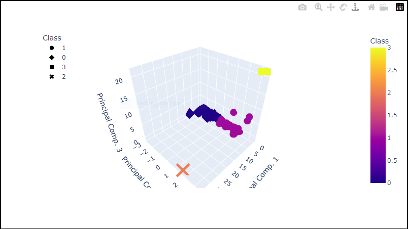
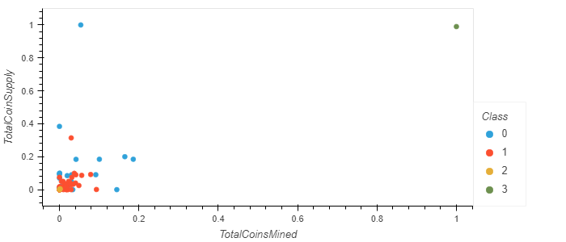
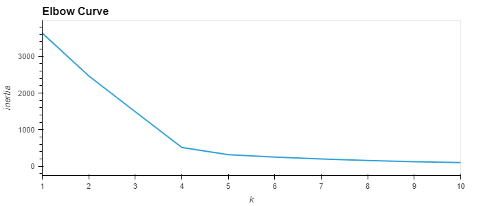

# __Cryptocurrencies__

## __Purpose of the Analysis__

For this analysis I was teamed up with an important personnel from __Accountability Accounting__ named Martha to utilize unsupervised learning. We were tasked with creating a clear analysis for our clients who are preparing to get into the cryptocurrency market.

### __Analysis Summary__

The _Cryptocurrency_ data was not ideal, so it was processed with machine learning models created to fit the data. PCA, and Clustering algorithms were also utilized using K-Means to further make the data fit. Finally, the _Cryptocurrencies_ data was made into data visualizations to share the findings with the clients.

Following are the rendered data visualizations, including a graph used to find the best value for `k`:

 3D-cryptocurrency
 

 Scatter-Plot 
 

 Elbow Curve to Find the Best Value for 'k'
 
